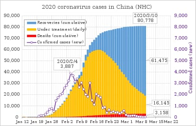
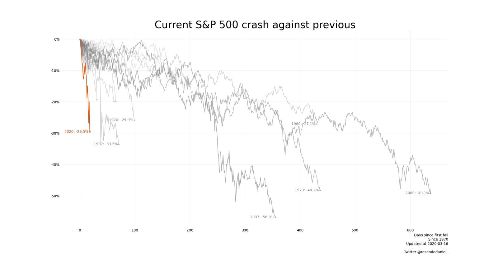
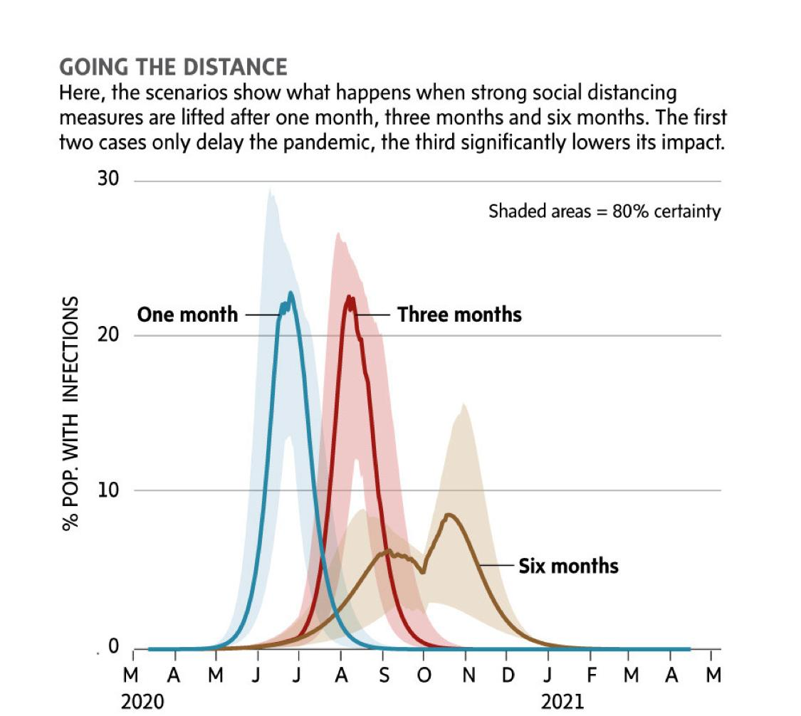

# Why are we doing this?

# Who are we?

# Government / NGO high quality data sources
1. [Canada COVID-19 "Current Situation"](https://www.canada.ca/en/public-health/services/diseases/2019-novel-coronavirus-infection.html?topic=tilelink#a1)
2. [WHO SitReps](https://www.who.int/emergencies/diseases/novel-coronavirus-2019/situation-reports)
3. [Our World in Data](https://ourworldindata.org/coronavirus-source-data)

# Compiled data and projections
1. [Cailens covid analyses](https://docs.google.com/spreadsheets/d/1LfAzVhs47rN0OQrQwAhiEwn27wnw18ORepoc9dfRzGg/edit?usp=sharing)
2. [Darren's covid analysis](https://docs.google.com/spreadsheets/d/1Hgx00JIy6APeMjXQNfqqHdYR5VfF1mTXl8Sk9-HkVIY/edit?usp=sharing)

# infographics
1. 
2. 
3. 
